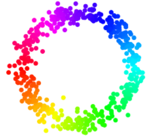
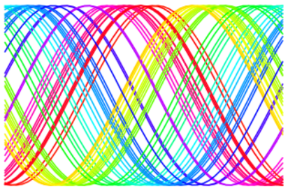
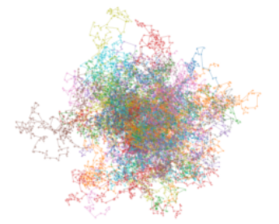
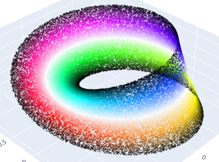
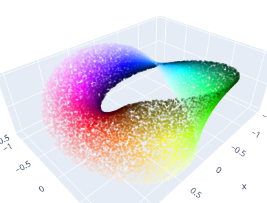
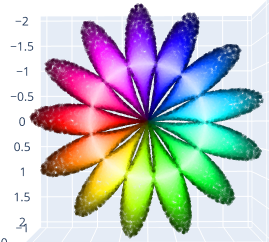

# Toy Data
**See [Examples.ipynb](Examples.ipynb) for code examples!**

Some simple data sets and environment to generate toy data, such as a noisy circle (**Circle2D**)

High-dimensional data with a circular topology (**CircleND**)

A random walker around a centre (**RandomWalker**)

or on a circle

Möbius strips (**MoebiusStrip**)

or strips with more twists

